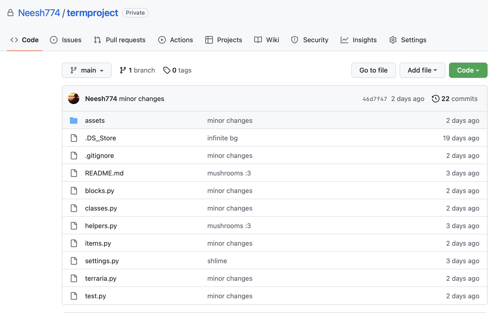

# Design Documentation

## Project: Terraria

A clone of Terraria written in Python with Tkinter and CMU_112_Graphics.

### Project Description

A clone of Terraria that has a different UI and some different aspects of gameplay.

### Structural Plan

Classes:

- Game (Coordinate System, helper functions, manages chunks)
- Chunk (Chunk of terrain)
- Functionality (Game states, event handlers, etc)
- Entity (Collision detection, movement, gravity, etc)
  - Player
  - Mushroom
  - Slime
  - Item (Item that can be picked up)
- InventoryItem (Item within player inventory)
  - Carrot
  - Bread
  - Apple
- Block (Manages one instance of a block)

Separated into `blocks.py`, `classes.py`, `helpers.py`, `items.py`, `terraria.py`, along with `settings.py` and `colors.py` for configuration.

### Algorithmic Plan

- Terrain Generation (Midpoint generation)
- Cave generation (My own design)
- Mob AI (Aggro and wandering)

### Timeline Plan

- TP 2: More items and blocks, reliable mob AI
- TP 3: Better image performance, use actual block sprites

### Version Control Plan

### Citations

Check README.md
